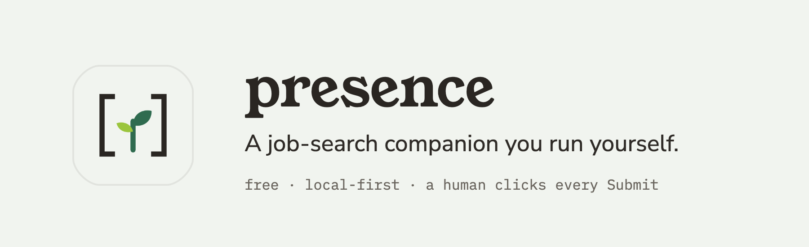
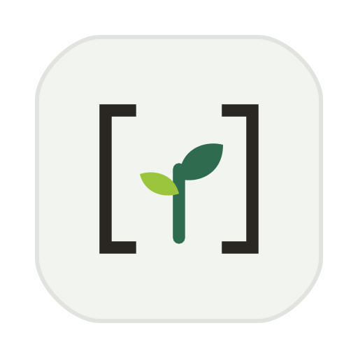
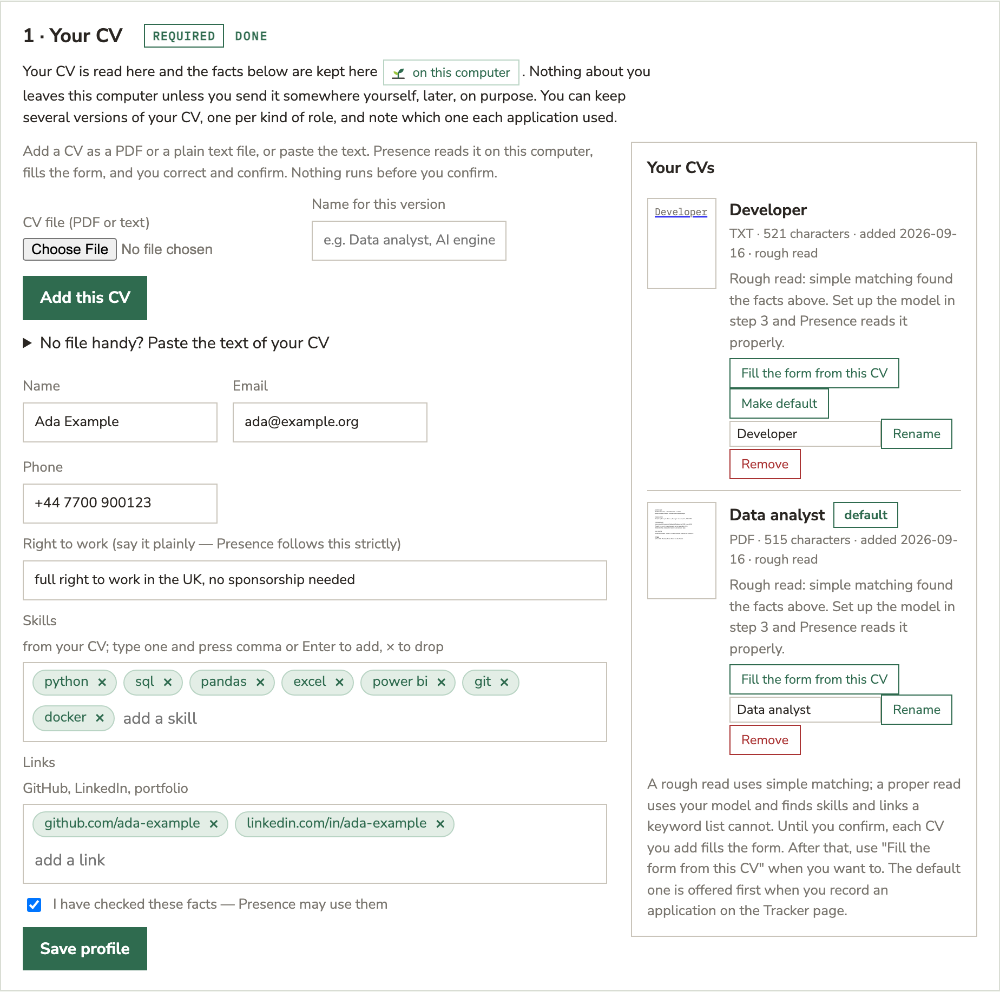
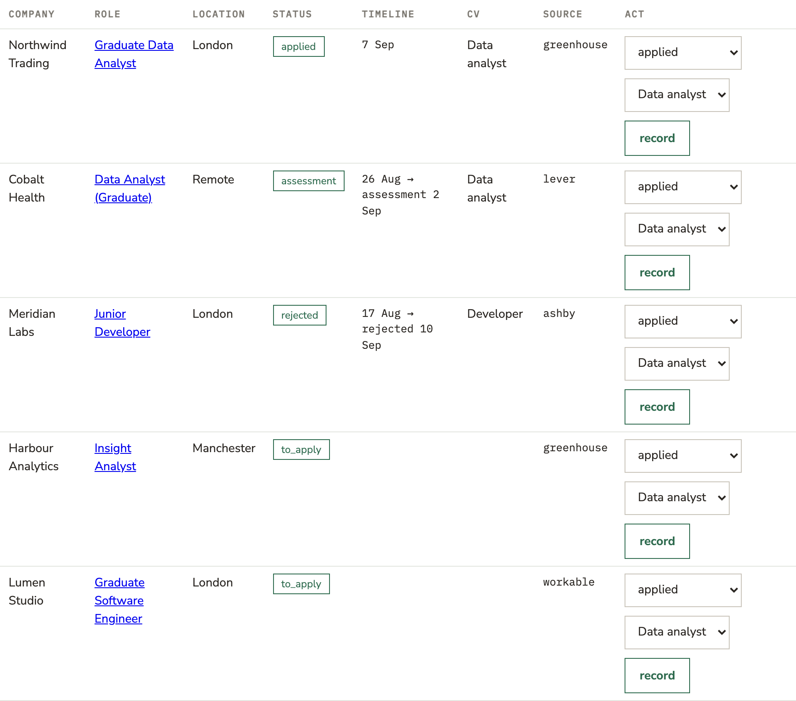
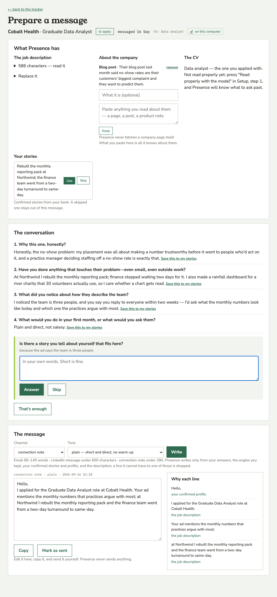
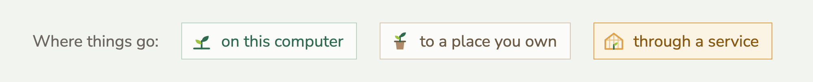

<p align="center">
  
</p>

<p align="center">
  <a href="https://github.com/Sofa3xpert/presence/releases"></a>
  
  
</p>

**A job-search companion you run yourself.** Presence is an open, local-first
system that hunts for roles while you live your life: an AI Scout searches and
judges postings against *your* rules, a tracker keeps honest state, and a daily
brief lands in your messenger. You talk to it in plain words. It never applies
on your behalf — **a human clicks every Submit**.

Built by a graduate who needed it, for everyone in the same seat.

## Why it's free

Job seekers and students are exactly the people who can't spend $40/month on
"career copilots" — so everything essential in Presence is free, forever, with
no tiers and no subscription. It runs on your machine, with your own model key
— or fully free end-to-end with a local model via Ollama. If Presence helps
you land somewhere, there's a sponsor button. That's the whole business model.

## The charter



Four rules, enforced in code — see [CHARTER.md](CHARTER.md):

1. **No auto-submit, anywhere.** Presence finds and prepares; the human applies.
2. **No invented facts.** Nothing extracted about you is used until you confirm it.
3. **Your data stays on your machine.** No telemetry, no cloud account, no exceptions.
4. **Hard daily spend cap.** The system can never surprise you with a bill.

## Get Presence

**macOS (Apple silicon, macOS 14 or newer):** download the Presence disk
image from the [GitHub Releases page](https://github.com/Sofa3xpert/presence/releases),
open it and drag **Presence** into **Applications**. That is the whole install.

The first launch has one extra step, because the app is not yet registered
with Apple: double-click Presence, click **Done** on the "Not Opened" message,
then open **System Settings → Privacy & Security**, scroll to the Security
section and click **Open Anyway**. Confirm with your Mac password. macOS
remembers the choice and Presence opens normally from then on.

**Windows and Linux:** a packaged app is on its way. Until then, the
developer route below works on any machine with Python 3.12.

## What happens next

1. Presence opens in your browser (only this computer can see the page).
2. Five short steps: read your CV and confirm the facts, paste a few
   companies' careers pages and set your filters, pick a model (free on this
   computer, or an API key), choose where the tracker lives, pair your own
   Telegram bot by scanning a code. Only the first two are required.
3. Every morning, while Presence is open, it reads those boards, applies your
   filters, updates the tracker and sends you a short brief — or shows it on
   the Run page if Telegram is not paired. You can also press **Run now**.
4. You apply. Presence never sends, submits or posts anything for you.
5. When you want to write to them, press **Prepare a message** on the job.
   Presence asks you a few questions, one at a time, about why this one and
   what you have actually done; it proposes angles you accept or reject; then
   it writes an email, a LinkedIn message or a connection note from your own
   words, and shows where every sentence came from. You copy it and send it
   yourself.

<p align="center">
  
  <br><em>Step one. Your CV is read here; the skills and links it finds become capsules you can edit, and you can keep one version per kind of role.</em>
</p>

Your applications live on the Tracker page, where each row remembers which CV you sent:

<p align="center">
  
</p>

<p align="center">
  
  <br><em>Prepare a message. Presence asks, you answer, it writes from your words — and shows its sources.</em>
</p>

## Add-ons

Why not build on OpenClaw or NemoClaw? OpenClaw is an MIT-licensed personal AI
agent daemon, run by a non-profit foundation, that connects any model to 29
messaging channels; its skills "browse the web, fill forms, read and write
files, run shell commands". NemoClaw is NVIDIA's stack on top of it for RTX PCs,
workstations and DGX machines: the OpenShell sandbox that isolates agents, local
Nemotron models, and a "privacy router" that sends some work to cloud models.
Neither is a model server. Presence's first rule is that a human clicks every
Submit; Presence never acts on a site on your behalf. An agent whose skills
browse and fill forms is the opposite design, and a sandbox is the enterprise
answer to a risk Presence avoids by not having the capability at all. Neither is
included or planned for the core. If people want them, they would ship as
optional add-ons, only if they keep the charter, marked like everything else:

| Add-on | What it would mean | Where your data goes |
|--------|--------------------|----------------------|
| OpenClaw channels | The daily brief through the messengers you already run in OpenClaw (WhatsApp, Telegram, Discord, Slack, Signal, iMessage) |  |
| Nemotron models | Possible today: pick a Nemotron model in the local engine |  |
| NemoClaw privacy router | Some of the work sent to cloud models through NVIDIA's router |  |

Sources: [openclaw.ai](https://openclaw.ai/) ·
[NVIDIA announces NemoClaw](https://nvidianews.nvidia.com/news/nvidia-announces-nemoclaw).

## Your data

Everything lives in one folder on your computer; the **Open data folder**
button in the app takes you there.

| System  | Folder                                        |
|---------|-----------------------------------------------|
| macOS   | `~/Library/Application Support/Presence`      |
| Windows | `%APPDATA%\Presence`                          |
| Linux   | `~/.local/share/presence`                     |

No account, no telemetry, no requests to anyone but the boards you chose,
your own Telegram bot and the model you picked. The pages are drawn with
fonts that ship with Presence.

Every option in the app is marked with where its data goes, so you never have to
guess:

<p align="center">
  
</p>

## For developers

The loop runs end to end on published job-board APIs and delivers to your own
Telegram bot. The `presence` command has an app and a plain command line:

```bash
git clone https://github.com/Sofa3xpert/presence.git && cd presence
uv sync
uv run presence serve            # the app: opens your browser, keeps the daily run alive
uv run presence check            # is everything in place?
uv run presence cycle            # one run, brief printed
uv run presence cycle --send     # …delivered to Telegram once it is paired in the app
```

The data folder defaults to the location above; `PRESENCE_DATA=<folder>` or a
positional `[data_dir]` overrides it. `presence serve --port N --no-browser`
pins the port and skips the browser.

Without uv, on a fresh machine (Python 3.12):

```bash
git clone https://github.com/Sofa3xpert/presence.git && cd presence
python3.12 -m venv .venv && source .venv/bin/activate   # Windows: .venv\Scripts\activate
pip install -r requirements.txt && pip install -e .
presence serve
```

`requirements.txt` is exported from `uv.lock` (`requirements-dev.txt` adds
pytest and ruff); CI fails if either drifts from the lock. CI runs the tests
on Ubuntu, macOS and Windows.

With Docker: `docker compose run --rm presence init /data`, then the same
commands with `/data` (the `./data` folder on the host holds everything).

Not there yet: Scout's judgment and tiering (the cycle currently applies your
filters only), alert-email intake, the apply extension. See the architecture
document for the plan.

**v1 scope** (see the architecture document, coming to `docs/`):
the user's chosen job boards (published APIs only), two agents (Scout + Brief), SQLite tracker,
Telegram delivery, BYO model key (Anthropic / OpenAI / Ollama), Docker,
conversational onboarding from an uploaded CV plus five questions.

## Layout

```
src/presence/
  core/        runtime: scheduler, agent executor, profile & rules, guards
  agents/      agent packs: Scout, Brief (versioned, user-editable prompts)
  connectors/  job sources behind one interface (published board APIs; catalog)
  adapters/    messenger transports (v1: Telegram)
  tracker/     SQLite tracker + conventions engine
  packs/       loaders for shareable packs (sims, drills — MIT-licensed formats)
packs/         the pack formats themselves (MIT)
docs/          documentation site source
```

## License

Core: [AGPL-3.0](LICENSE). Pack and SDK formats under `packs/`: MIT — so the
things the community shares stay frictionless.
